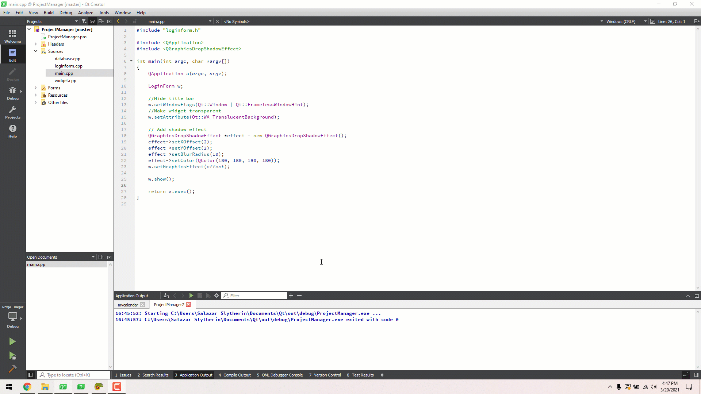

  

<h1 align="center"> Projects Manager </h1>

  
  

<h4 align="center">A program to manage your team's project. Included many amazing features.</h4>

## About
*Full version coming soon...*
## Preview

## Information 🏷
- __Language:__ _C++_
- __Framework:__ _Qt 6_ 
- __Operating System:__ _Kali Linux 2021.1_

## Features
- *Deadline (To-do list)*
- *Create timetable*
- *Work Assignment*
- *File sharing*
- *Live chat*
- *Video call*

## Collaborators
Updating...